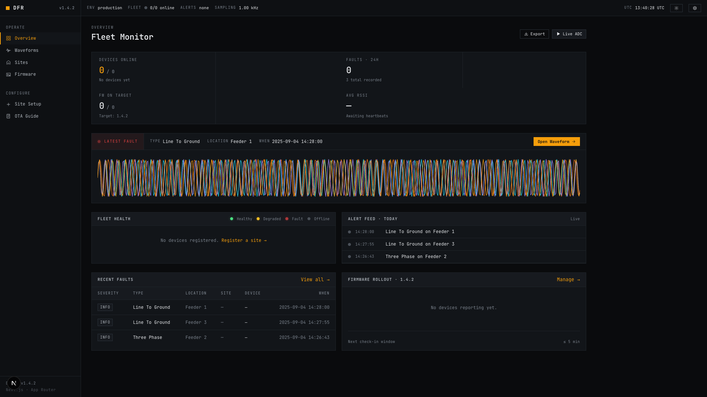
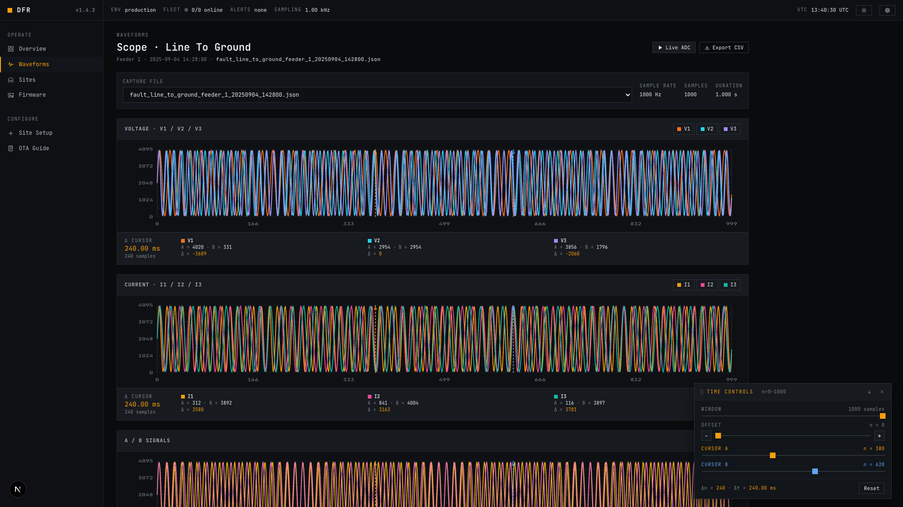
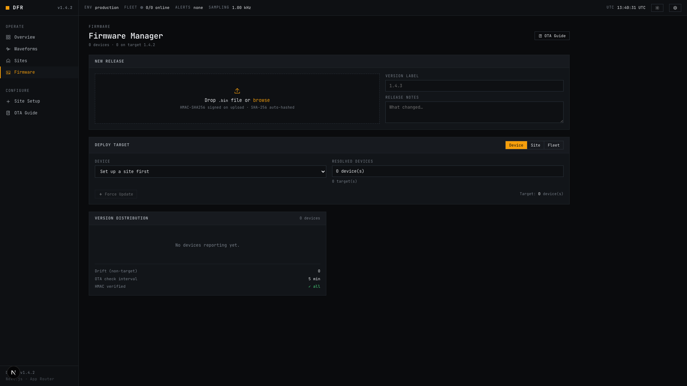
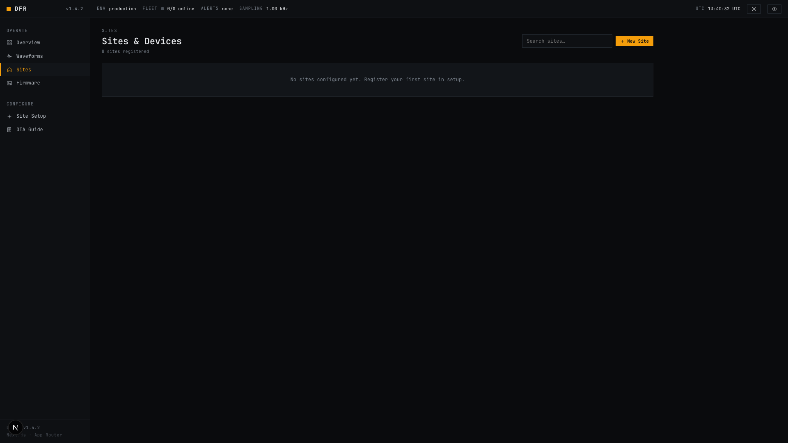

# DFR — Digital Fault Recorder

A full-stack IoT system for monitoring electrical faults and managing ESP32 firmware. Combines a **Next.js web dashboard** with **Arduino-based ESP32 firmware** for real-time ADC sampling, waveform visualization, and secure over-the-air updates.

## Tech Stack

| Layer | Technology |
|-------|-----------|
| Frontend | Next.js 15 (App Router), React 19, Tailwind CSS 4, Chart.js 4.5 |
| Backend | Next.js API Routes, Prisma ORM (SQLite default, Postgres-ready), legacy JSON persistence behind `USE_DB` flag |
| Deployment | Docker multi-stage build, docker-compose with named volumes |
| ESP32 | Arduino Core, WiFi, HTTPClient, Update, ArduinoJson, mbedtls |

## Getting Started

### Prerequisites

- Node.js 18+
- npm

### Installation

```bash
git clone https://github.com/patthananb/dfr.git
cd dfr
npm install
```

### Environment Variables

Copy the example and set your HMAC secret:

```bash
cp .env.example .env
```

| Variable | Description |
|----------|-------------|
| `FIRMWARE_HMAC_SECRET` | Shared secret for firmware signing. Must match `HMAC_SECRET` in `esp32/config.h`. |
| `DATABASE_URL` | Prisma datasource. Defaults to `file:../data/dfr.db` (SQLite). Swap for a `postgresql://...` URL and flip the provider in `prisma/schema.prisma` to use Postgres. |
| `USE_DB` | `1`/`true`/`on` to route persistence through Prisma. Unset/false keeps the legacy JSON file backend. |

### Database Setup

Prisma is used for structured persistence. The default provider is SQLite and the DB file lives at `data/dfr.db` (git-ignored).

```bash
npm run db:migrate        # Apply migrations in dev (creates data/dfr.db)
npm run db:deploy         # Apply migrations in prod (no schema drift)
npm run db:studio         # Open Prisma Studio
npm run db:migrate-data   # One-shot import from existing JSON files into the DB
```

The migration importer reads `data/sites.json`, `data/heartbeat.json`, `data/force-updates.json`, `data/*.json` fault recordings, and `firmware/{espId}/manifest.json`. It is idempotent — use `--dry-run` to preview and `--wipe` to truncate before re-running.

### Database Schema

The system uses the following relational model (managed via Prisma):

#### `Site`
Groups devices by physical location and stores shared credentials.
| Field | Type | Description |
|-------|------|-------------|
| `id` | String (PK) | Unique site identifier |
| `name` | String | Display name (e.g., "Substation A") |
| `location` | String? | Optional physical address or coordinates |
| `ssid` | String? | WiFi network name for the site |
| `passwordEnc` | String? | AES-256 encrypted WiFi password |

#### `Device`
Represents an individual ESP32 unit.
| Field | Type | Description |
|-------|------|-------------|
| `espId` | String (PK) | Device ID (usually `esp32-{MAC}`) |
| `siteId` | String? (FK) | Reference to the parent `Site` |
| `label` | String? | Friendly name for the device |

#### `Heartbeat`
Time-series status updates recorded every 60s.
| Field | Type | Description |
|-------|------|-------------|
| `espId` | String (FK) | Reference to the reporting `Device` |
| `ts` | DateTime | Arrival timestamp |
| `ip` | String? | Local IP address |
| `rssi` | Int? | Signal strength (dBm) |
| `uptime` | Int? | Seconds since last boot |
| `freeHeap` | Int? | Available RAM (bytes) |
| `firmwareVersion` | String? | Currently running firmware version |

#### `Fault`
Electrical event recordings containing waveform samples.
| Field | Type | Description |
|-------|------|-------------|
| `faultType` | String | Category (e.g., `line_to_ground`, `three_phase`) |
| `faultLocation` | String | Feeder or phase identifier |
| `espId` | String? (FK) | Device that recorded the fault |
| `recordedAt` | DateTime | Timestamp of the event |
| `payload` | JSON/String | Array of ADC samples (V1-V3, I1-I3, A, B) |

#### `FirmwareVersion`
Metadata for binary blobs stored on disk.
| Field | Type | Description |
|-------|------|-------------|
| `espId` | String (FK) | Device this binary is built for |
| `version` | String? | Semantic version (e.g., `1.2.0`) |
| `sha256` | String | SHA-256 hash of the binary |
| `hmacSignature` | String | HMAC-SHA256 signature for OTA verification |
| `isActive` | Boolean | Whether this is the current target version |

#### `ForceUpdate`
Admin flags to trigger immediate OTA check-ins.
| Field | Type | Description |
|-------|------|-------------|
| `espId` | String? (FK) | Specific device target |
| `siteId` | String? (FK) | All devices at a specific site |
| `versionTarget` | String? | Optional version to force |

### Running

```bash
npm run dev      # Development server on http://localhost:3000
npm run build    # Production build (runs prisma generate first)
npm run start    # Start production server
npm run lint     # Run ESLint
```

### Test Data

Generate synthetic sine-wave fault data without real hardware:

```bash
./send-dummy-data.sh
```

This creates JSON files in `data/` with 1000 samples across 8 channels (V1–V3, I1–I3, A, B) using randomized frequencies and fault types.

## Project Structure

```
dfr/
├── esp32/                    ESP32 Arduino firmware
│   ├── esp32.ino             Main firmware (OTA client + ADC sampler)
│   ├── config.h              WiFi, server, ADC, timing configuration
│   └── README.md             ESP32 coding guidelines and hardware details
├── src/
│   ├── app/
│   │   ├── page.js           Home — latest fault summary
│   │   ├── graph/page.js     Waveform viewer + live ADC mode
│   │   ├── firmware/         Firmware management UI
│   │   ├── sites/            Site management pages
│   │   └── api/
│   │       ├── data/         Fault data retrieval + ADC upload
│   │       ├── faults/       Fault query/filtering
│   │       ├── firmware/     OTA firmware endpoints
│   │       ├── sites/        Site CRUD
│   │       └── status/       Device heartbeat tracking
│   ├── components/
│   │   └── Navbar.jsx        Navigation bar
│   └── lib/
│       ├── validate.js       Path traversal prevention
│       ├── json-store.js     Atomic JSON read-modify-write with locking
│       ├── crypto.js         HMAC-SHA256 signing/verification
│       ├── db.js             Prisma client singleton
│       ├── feature-flags.js  `isDbEnabled()` — USE_DB switch
│       ├── firmware.js       Shared firmware manifest helpers (JSON path)
│       ├── sites.js          Site data helpers (JSON path)
│       └── repos/            Backend-agnostic repo layer (sites, status,
│                             firmware, faults, force-updates) that branches
│                             on USE_DB between JSON and Prisma
├── prisma/
│   ├── schema.prisma         DB schema (Site, Device, Heartbeat, Fault,
│   │                         FirmwareVersion, ForceUpdate)
│   └── migrations/           Prisma-managed SQL migrations
├── scripts/
│   └── migrate-json-to-db.mjs  One-shot JSON → DB importer
├── docker/
│   └── entrypoint.sh         Runs `prisma migrate deploy` then starts the app
├── Dockerfile                Multi-stage build (deps → build → runner)
├── docker-compose.yml        Web service + named volumes (Postgres commented)
├── data/                     Runtime — SQLite DB, fault JSON files, heartbeat, sites
├── firmware/                 Runtime — firmware binaries per device
├── send-dummy-data.sh        Test data generator
└── CLAUDE.md                 AI assistant guidance
```

Both `data/` and `firmware/` are git-ignored and created at runtime. The SQLite database (`data/dfr.db`) is also git-ignored.

## Web Pages

| Route | Description |
|-------|-------------|
| `/` | Dashboard showing the latest fault with a link to view its waveform |
| `/graph` | File picker with Chart.js graphs for voltage, current, and A/B signals. Includes a **Live ADC** mode that auto-refreshes every 3 seconds. |
| `/firmware` | Upload firmware, view version history, set active version, rollback, and bulk deploy across devices |
| `/firmware/guide` | Step-by-step OTA setup guide for ESP32 devices |
| `/sites` | List all sites with device online/offline status |
| `/sites/setup` | Register a new site with devices and WiFi credentials |
| `/sites/[id]` | Site detail — heartbeat info, firmware status, fault history, edit |

## Screenshots

### Dashboard (Overview)
Central monitoring hub showing fleet status, device health, firmware targets, latest fault events, and a summary waveform.



### Waveforms (Graph Viewer)
Interactive oscilloscope-style viewer for fault data with multi-channel display (voltage V1/V2/V3 and current I1/I2/I3), time-window controls, dual cursors for measurement, and Live ADC mode for real-time sampling.



### Firmware Manager
Upload new firmware versions, set active releases per device, view version history, and bulk deploy across sites or fleet. HMAC-SHA256 signature verification on upload.



### Sites & Devices
Register sites, manage ESP32 devices per location, track online/offline status, and monitor device heartbeats and firmware versions.



## API Reference

### Sensor Data — `/api/data`

| Method | Params | Description |
|--------|--------|-------------|
| `GET` | — | List all data filenames |
| `GET` | `?file=<name>` | Retrieve a specific data file |
| `GET` | `?latest=<prefix>` | Get the most recent file matching a prefix (e.g. `adc_live`) |
| `POST` | `{ espId, faultType, faultLocation, date, time, sampleRateHz, data }` | Upload ADC/fault samples from ESP32 |

### Fault Listing — `/api/faults`

| Method | Params | Description |
|--------|--------|-------------|
| `GET` | `?site=<name>` (optional) | List fault records, optionally filtered by site |

### Device Status — `/api/status`

| Method | Params | Description |
|--------|--------|-------------|
| `GET` | — | All devices with online status (online = heartbeat within 5 min) |
| `POST` | `{ espId, timestamp?, firmwareVersion?, rssi?, uptime?, freeHeap? }` | Record a heartbeat |

### Site Management — `/api/sites`

| Method | Params | Description |
|--------|--------|-------------|
| `GET` | — | List all sites (WiFi passwords stripped) |
| `POST` | `{ name, wifi: { ssid, password }, devices }` | Create a site |
| `PUT` | `{ id, name, wifi, devices }` | Update a site |
| `DELETE` | `?id=<siteId>` | Delete a site |

### Firmware OTA — `/api/firmware`

| Method | Params | Description |
|--------|--------|-------------|
| `GET` | `?espId=<id>` (optional) | List firmware versions for one or all devices |
| `POST` | FormData: `file`, `espId`, `version?`, `releaseNotes?` | Upload firmware binary (auto-sets as active) |
| `PUT` | `{ espId, active }` | Set active firmware version |
| `DELETE` | `?espId=<id>&filename=<name>` | Delete a firmware version |

### Firmware Sub-endpoints

| Endpoint | Method | Description |
|----------|--------|-------------|
| `/api/firmware/check?espId=...&currentVersion=...` | `GET` | ESP32 check-in — returns signed manifest if update available |
| `/api/firmware/latest?espId=...` | `GET` | Download active firmware binary (with SHA-256 and version headers) |
| `/api/firmware/rollback` | `POST` | `{ espId }` — Revert to the previous firmware version |
| `/api/firmware/force` | `POST` | `{ espId \| siteId \| all: true }` — Flag devices for forced update |
| `/api/firmware/force` | `GET` | List current force-update flags |

## Data Format

Fault and ADC data files follow this schema:

```json
{
  "faultType": "line_to_ground",
  "faultLocation": "feeder_1",
  "date": "2026-03-15",
  "time": "14:30:00",
  "sampleRateHz": 1000,
  "data": [
    { "n": 0, "v1": 2047, "v2": 2047, "v3": 2047, "i1": 2047, "i2": 2047, "i3": 2047, "A": 2047, "B": 2047 },
    { "n": 1, "v1": 2100, "v2": 1990, "v3": 2050, "i1": 2080, "i2": 2010, "i3": 2045, "A": 2060, "B": 2030 }
  ]
}
```

Filenames follow the pattern `{faultType}_{faultLocation}_{YYYYMMDD}_{HHmmss}.json`.

## ESP32 Firmware

The Arduino sketch in `esp32/` handles three tasks:

1. **Heartbeat** — sends device status (RSSI, uptime, free heap, firmware version) to `POST /api/status` every 60 seconds
2. **OTA updates** — checks `GET /api/firmware/check` every 5 minutes; downloads, verifies (SHA-256 + HMAC-SHA256), and flashes new firmware
3. **ADC sampling** — reads 8 channels via hardware timer interrupt and uploads batches to `POST /api/data`

See [esp32/README.md](esp32/README.md) for coding guidelines, hardware details, and best practices.

### ADC Pin Assignments

| Channel | GPIO | ADC |
|---------|------|-----|
| V1, V2, V3 | 32, 33, 34 | ADC1 |
| I1, I2, I3 | 35, 36, 39 | ADC1 |
| A, B | 25, 26 | ADC2 |

### Configuration (`esp32/config.h`)

| Setting | Default | Description |
|---------|---------|-------------|
| `WIFI_SSID` / `WIFI_PASSWORD` | — | WiFi credentials |
| `SERVER_HOST` | `192.168.1.100` | DFR server address |
| `SERVER_PORT` | `3000` | DFR server port |
| `DEVICE_ID` | Auto from MAC | ESP32 device identifier |
| `FW_VERSION` | `1.0.0` | Current firmware version string |
| `HMAC_SECRET` | — | Shared secret (must match `FIRMWARE_HMAC_SECRET`) |
| `HEARTBEAT_INTERVAL_MS` | `60000` | Heartbeat frequency |
| `OTA_CHECK_INTERVAL_MS` | `300000` | OTA check frequency |
| `ADC_SAMPLE_INTERVAL_US` | `1000` | Sample interval (1 kHz) |
| `ADC_SAMPLES` | `256` | Samples per batch |
| `ADC_RESOLUTION` | `12` | ADC bit resolution (9–12) |

## Persistence

The app supports two interchangeable backends behind a single repo layer (`src/lib/repos/`). Every API route calls the repo, and the repo branches on `isDbEnabled()`:

| Backend | When active | Where state lives |
|---------|-------------|-------------------|
| JSON (legacy) | `USE_DB` unset/false | `data/*.json`, `firmware/{espId}/manifest.json` |
| Prisma | `USE_DB=1` | `data/dfr.db` (SQLite) or Postgres via `DATABASE_URL` |

Firmware binaries stay on disk under `firmware/{espId}/` in both backends — only the manifest metadata moves into the DB. This preserves the byte-identical binary that the HMAC signature was computed over, which is required for the ESP32 to accept the update.

The `FirmwareVersion`, `Heartbeat`, `Fault`, and `ForceUpdate` tables use indexed `espId` columns so per-device lookups stay fast as the dataset grows. Fault payloads are stored as JSON (TEXT on SQLite, JSONB on Postgres).

## Docker Deployment

```bash
docker compose up --build
```

The bundled `Dockerfile` uses a multi-stage build (deps → build → runner) on `node:20-slim`, produces the Next.js standalone output, and runs as a non-root user. The `docker/entrypoint.sh` script runs `prisma migrate deploy` on startup, then execs the app.

`docker-compose.yml` mounts two named volumes so state survives container restarts:
- `dfr-data` → `/app/data` (SQLite DB + fault JSON)
- `dfr-firmware` → `/app/firmware` (firmware binaries)

A commented-out `db` service is included for the Postgres path — uncomment it, flip `DATABASE_URL` and the `provider` in `prisma/schema.prisma`, and rebuild.

## Security

- All API routes validate path segments with `isSafePathSegment()` to prevent path traversal
- Firmware manifests are signed with HMAC-SHA256; the ESP32 verifies signatures before flashing
- HMAC comparison uses timing-safe equality to prevent timing attacks
- JSON backend: writes use atomic temp-file + rename and are serialized with an in-process mutex
- Prisma backend: multi-step updates run inside `prisma.$transaction` to preserve invariants (e.g. site device-set replacement)
- WiFi passwords are stripped from all API responses via `sanitizeSites()`
